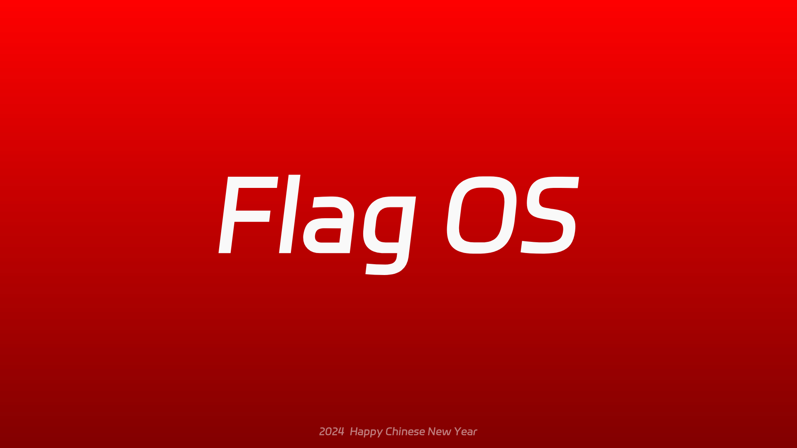

# Flag OS 2 | 自成边界



## 关于 mPython/掌控板

mPython掌控是一块MicroPython微控制器板。掌控板是创客教育专家委员会、猫友汇、广大一线老师共同提出需求并与创客教育行业优秀企业代表共同参与研发的教具、学具，是一块为教育而生的开源硬件，也是一个公益项目。

## 关于 Flag OS

Flag OS 是运行在 mPython （掌控版）平台上的轻量级多文件操作系统，旨在致力于构建完整的 mPython 生态体验。Flag OS 也是一个为 mPython 开发者们准备好的全新平台，这里优化了大量官方固件中缺失的体验与功能，向 mPython 硬件的极限靠近。Flag OS 不是 mPython 中的 MIUI ，也不会成为 mPython 中的 MIUI ，为了保证各位开发者能将程序毫发无损的迁移至 Flag OS ，我们并未对固件做破坏性改动或删除重要功能，这将是日后， Flag OS 生态强健有力的基础。

## Flag OS 现有版本文件目录

```
/

│  boot.py  # Flag OS BIOS，用于引导系统/用户程序运行
│
└─Flag_OS  # Flag OS System
        │
        ├─system  # 系统核心代码
        │      core.py  # 系统可调用代码
        │      pages.py  # 系统可调用页面
        │      main.py  # 系统引导后最先运行的代码
        │      ui.py  # 日光引擎
        │
        ├─data  # 系统数据
        │      brightness.fos  # 系统显示亮度
        │      volume.fos #系统音量
        │      light.fos #系统日光/黑夜模式数据存放
        │
        ├─apps  # 系统应用
        │      app_0.py  # 系统设置
        │      app_1.py  # 线上插件
        │
        ├─fonts  # 系统可调用字体
        │      quantum.py  # 桌面时间字体
```

# 开发注意事项

请注意，您的开发应当基于 Alpha 分支，您的提交也应在 Alpha 分支进行

目前该系统没有正式版本