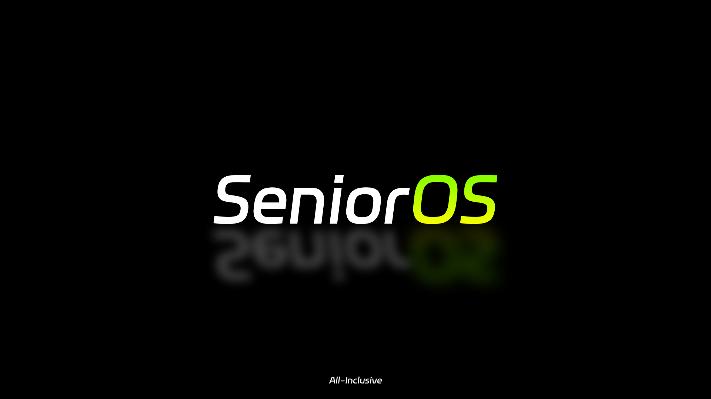

# 苍旻操作系统｜SeniorOS

轻量，强大的 mPython 操作系统

[官网/文档](https://senior.stfp.site/)



## 关于 mPython/掌控板

mPython掌控是一块MicroPython微控制器板。掌控板是创客教育专家委员会、猫友汇、广大一线老师共同提出需求并与创客教育行业优秀企业代表共同参与研发的教具、学具，是一块为教育而生的开源硬件，也是一个公益项目。

## 关于 SeniorOS

SeniorOS 是运行在 mPython （掌控版）平台上的轻量级多文件操作系统，旨在致力于构建完整的 mPython 生态体验。SeniorOS 也是一个为 mPython 开发者们准备好的全新平台，这里优化了大量官方固件中缺失的体验与功能，向 mPython 硬件的极限靠近。SeniorOS 不是 mPython 中的 MIUI ，也不会成为 mPython 中的 MIUI ，为了保证各位开发者能将程序毫发无损的迁移至 SeniorOS ，我们并未对固件做破坏性改动或删除重要功能，这将是日后， SeniorOS 生态强健有力的基础。

## SeniorOS 现有版本文件目录

### 编译前

```
/code

│  boot.py  # SeniorOS 启动选择器，用于引导系统/用户程序运行
│
└─SeniorOS  # System
        |
        ├─system  # 系统核心代码
        │      core.py  # 系统可调用代码
        │      pages.py  # 系统可调用页面
        │      main.py  # 系统引导后最先运行的代码
        │      ui.py  # 日光引擎
        │
        ├─data  # 系统数据
        │      brightness.fos  # 系统显示亮度
        |      fileList.json  # 系统更新文件
        │      volume.fos  # 系统音量
        │      light.fos  # 系统日光/黑夜模式数据存放
        |      wifi.fos  # WIFI 预配置文件
        │
        ├─apps # 本地预置应用
        |         logo.py  # 软件图标
        |  └─ app_0  # 系统设置
        |           core.py  # 核心代码
        |           main.py  # 主体
        |      
        |  └─ app_1  # 线上插件
        |           main  # 主体
        │
        ├─fonts  # 系统字体
        │      quantum.py  # 桌面时间字体
```

### 编译后

```
/build

│  boot.py  # SeniorOS 启动选择器，用于引导系统/用户程序运行
│
└─SeniorOS  # System
        |
        ├─system  # 系统核心代码
        │      core.mpy  # 系统可调用代码
        │      pages.mpy  # 系统可调用页面
        │      main.mpy  # 系统引导后最先运行的代码
        │      ui.mpy  # 日光引擎
        │
        ├─data  # 系统数据
        │      brightness.fos  # 系统显示亮度
        |      fileList.json  # 系统更新文件
        │      volume.fos  # 系统音量
        │      light.fos  # 系统日光/黑夜模式数据存放
        |      wifi.fos  # WIFI 预配置文件
        │
        ├─apps # 本地预置应用
        |         logo.py  # 软件图标
        |  └─ app_0  # 系统设置
        |           core.py  # 核心代码
        |           main.py  # 主体
        |      
        |  └─ app_1  # 线上插件
        |           main  # 主体
        │
        ├─fonts  # 系统字体
        │      quantum.mpy  # 桌面时间字体
```

# 开发注意事项

请注意，您的开发应当基于 Alpha 分支，您的提交也应在 Alpha 分支进行

目前该系统没有正式版本


## 如何构建？

本系统使用了专用的特殊工具以提高代码精简度/可读性，如果您对系统在本地仓库做了一定更改，并不能直接刷入至掌控版中

我们编写了`./tools/Build.py`，您可以在本地仓库中**直接运行它**来构建**SeniorOS**

但在此之前，您需要进行一些简单的环境配置

### 创建并激活虚拟环境
```bash
# 如果是 Linux 系统：
bash initBuildEnv.sh
# 如果是 Windows 系统：
./initBuildEnv.bat
```

### 构建

非常简单 一句话即可：
```bash
python ./tools/Build.py
```

将会在`./build`目录下生成真正可运行的文件 使用软件将其按目录结构全部刷入即可.
